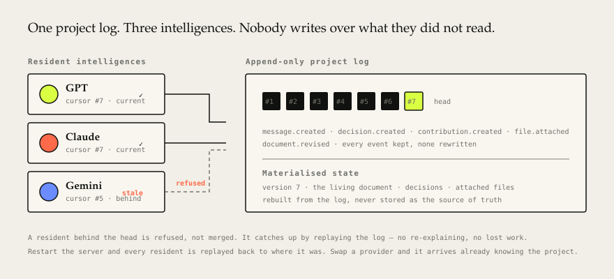

# Northstar Cognitive Project Platform

[](https://github.com/allinerosamkup-ai/northstar-cognitive-platform/actions/workflows/test.yml)
[](LICENSE)



**Two models writing into the same project overwrite each other's work.**
Give GPT and Claude a shared task and you get lost edits, contradictory
decisions, and a model confidently building on a state that changed three
turns ago. The usual workaround is you: copy-pasting context between tabs,
being the integration layer.

Northstar is a working prototype of the alternative — one canonical,
append-only event log that GPT, Claude, and Gemini all read from and write to,
with **cursor-based staleness protection**: each resident tracks how far into
the log it has actually seen, and the mesh refuses any contribution from a
resident whose cursor is behind. A model physically cannot write over
something it never read.

That log is the whole design. Work topologies, provider failover, and the
document the residents build together are all consequences of it.

```js
// src/core/cognitive-mesh.js — the guarantee, in full
async contribute(projectId, residentId, payload) {
  return this.#withLock(projectId, async () => {          // serialized per project
    const resident = this.resident(projectId, residentId);
    const state = await this.brain.getState(projectId);
    if (resident.cursor !== state.version) throw new Error("Resident is stale");
    return this.publish(projectId, { type: "contribution.created", actorId: residentId, payload });
  });
}
```

## Try it in under 5 minutes — no API key needed

The app ships in **demo mode**: the residents answer with clearly-labelled
canned text, so you can run everything, read the code, and see the mesh work
without spending a cent or holding a key.

Requires **Node.js 22 or newer**. There are no third-party dependencies —
not in the core, not in the server, not in the tests.

```sh
npm start
```

Open `http://127.0.0.1:4310`, type a question and press **Enter**. Then open
the **Document** view and give it something to build.

Everything the interface does, the CLI does too — the two share one project:

```sh
npm run cli -- status
npm run cli -- ask "What should we build first?"
npm run cli -- meet "Local or cloud storage?"
npm run cli -- build "Draft the launch plan"
npm run cli -- save
```

Want real OpenAI/Anthropic/Gemini calls instead of canned text? See
[Provider configuration](#provider-configuration).

## What works

- Append-only project event stream and materialized project state
- Three simultaneously present resident LLM runtimes
- Stale-contribution protection
- Solo, distributed, parallel, joint, and composite work topology support
- Traceable composite cognition
- Provider-credit failover without retelling the project
- Durable append-only JSONL Project Brain with serialized writes
- One Context API shared by the visual application and CLI
- English-first visual project room
- Permission-ready execution boundary
- Real OpenAI, Anthropic, and Gemini API adapters plus safe demo providers
- Browse a local folder and attach a file into the shared project brain
- Working sessions where the residents read and answer each other, then conclude
- Divide the work: each resident argues for the parts it should take
- Every conclusion is a proposal — the person running the project decides
- A living project document the intelligences build and revise together
- Writes real files to disk from what they build
- API keys configured in the app, stored locally, testable before you spend

## CLI

The CLI and the visual application operate on the same project — a decision
recorded in one appears in the other immediately.

```sh
npm run cli -- help          # every command
npm run cli -- status        # who is present, what they have heard
npm run cli -- ask "..."     # ask the project; the residents answer
npm run cli -- meet "..."    # a working session: propose, respond, conclude
npm run cli -- conclude      # accept the conclusion, or write your own
npm run cli -- divide "A|B"  # they argue for parts of the work
npm run cli -- build "..."   # produce the next revision of the document
npm run cli -- document      # print the current document
npm run cli -- save          # write it to disk
npm run cli -- ls            # browse the workspace
npm run cli -- attach FILE   # put a file into the shared project
npm run cli -- providers     # which intelligences are live, which are demo
npm run cli -- set-key claude sk-...   # configure one, then test it
```

Add `--json` to any command for machine-readable output, `--topology solo` to
choose who answers, and `--with gpt,claude` to pick specific residents. Set
`COGNITIVE_API_URL` to reach a server on another port or host.

## Test

```sh
npm test
```

Node's built-in test runner (`node --test`), no test framework dependency.

## Working sessions

The residents do not only answer in parallel — they can hold a session:

1. **Propose.** Each one answers the question in its own voice.
2. **Respond.** Each one reads what the others said and answers them, and may
   change its position.
3. **Conclude.** One of them (a live model whenever there is one) reconciles
   the positions, listing what was agreed and what was not.

The conclusion is a **proposal**. Nothing becomes a decision until you accept
it or write your own — disagreement is surfaced rather than averaged away.

```sh
npm run cli -- cost                       # what a session will spend, first
npm run cli -- meet "Local or cloud?"     # the three rounds
npm run cli -- conclude                   # accept their conclusion
npm run cli -- conclude "your decision"   # or overrule it
```

Work can be divided the same way: each resident argues for the parts it is
best placed to take, one of them proposes the split, and you approve or change
it before it becomes the project's.

```sh
npm run cli -- divide "Architecture | Research | Launch"
npm run cli -- confirm-division
```

A session is the most expensive thing the app does — two provider calls per
participant plus one for the conclusion — so the cost is shown before you
start one, in the interface and in the CLI.

## Building something

The **Document** view is where the intelligences produce work rather than talk
about it. Give an instruction and they return a full revision of the project
document; give another and they revise it. Every revision is an event in the
project brain, so the history is the document's history.

Attached files feed into a build, and any file the document proposes can be
written to the workspace folder with one click. An existing file is never
overwritten without asking.

## Provider configuration

Northstar starts on deterministic demo providers, so it runs with no key and
costs nothing. Add a key to replace a demo resident with the real intelligence.

**The easy way:** open **Settings** in the app, paste a key, pick a model, and
press **Test connection** — it makes one minimal real call and reports exactly
what the provider said. A wrong or retired model id shows up there in seconds
instead of failing partway through a conversation. Keys are written to your
local `.env`, are never displayed back to you, and are never sent anywhere
except the provider they belong to.

**The manual way:** copy `.env.example` to `.env` and fill it in. Northstar
reads that file at startup; a real environment variable takes precedence over
it.

Supplying a key is the whole switch — there is no second flag to remember.
`LIVE_RESIDENCY` is a separate, off-by-default setting that makes residents call
their provider on every event just to acknowledge it; it multiplies cost without
adding capability, because each request already carries the full context.

Each person runs Northstar on their own machine with their own keys — there
is no shared hosted instance and no account system, so your usage and your
API costs are entirely your own.

## Attaching local files

The **Files** view browses a folder on your machine and attaches a text file
into the project brain, so every resident sees its content.

The browsable root is `COGNITIVE_WORKSPACE_PATH` (default: the folder you
started the server from). Nothing outside that root is readable — the server
resolves every requested path, follows symlinks, and refuses anything that
lands outside. Attachments are capped at 256 KB and must be text.

In demo mode the residents receive the attachment event but ignore its
content, because the demo provider answers with fixed text. File content only
influences an answer once live providers are enabled.

## Architecture

```text
Visual App ─┐
CLI ────────┼── Context API ── Cognitive Mesh ── Resident LLMs
SDK ────────┘                       │
                              Project Brain
                         events · state · provenance
```

The application owns the project context. Providers supply participating
intelligences. Execution agents remain an optional, separately authorized
layer.

## Project Brain storage

The Project Brain is an append-only JSONL log at `data/project-brain.jsonl`:
one line per record, appended and never rewritten, so write cost stays
constant as the project grows and a crash cannot rewrite existing history. A
truncated final line — the signature of a crash mid-append — is dropped on
read instead of failing the whole log.

Writes are serialized per log file, so concurrent callers cannot claim the
same event sequence and overwrite each other. Contributions are serialized
per project, keeping the staleness check and the write atomic.

An older whole-file `data/project-brain.json` is migrated automatically on
first read and kept in place as a backup.

## Event surfaces

`src/core/event-catalog.js` classifies each event type:

- **surface** — project content a model must read: `message.created`, `decision.created`, `task.created`, `contribution.created`
- **log-only** — bookkeeping: `collective.started`, `resident.paused`

Live providers build prompts from surface events only, and live residency
skips provider calls for log-only events. An unclassified type defaults to
surface so new content is never hidden from a model by accident.

## Contributing

Issues and pull requests are welcome — see [CONTRIBUTING.md](CONTRIBUTING.md)
for how to run the project, run the tests, and what a good PR looks like.
Please also read the [Code of Conduct](CODE_OF_CONDUCT.md).

## License

[MIT](LICENSE)
